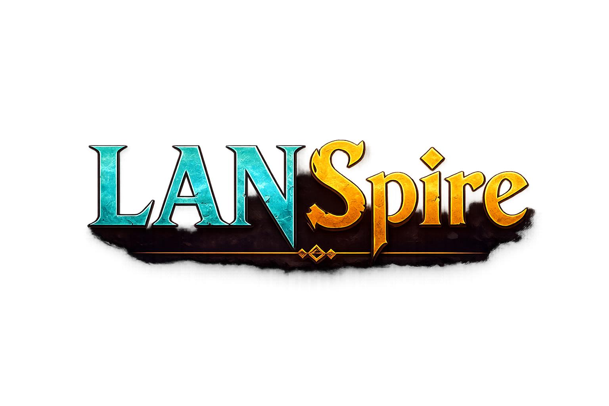
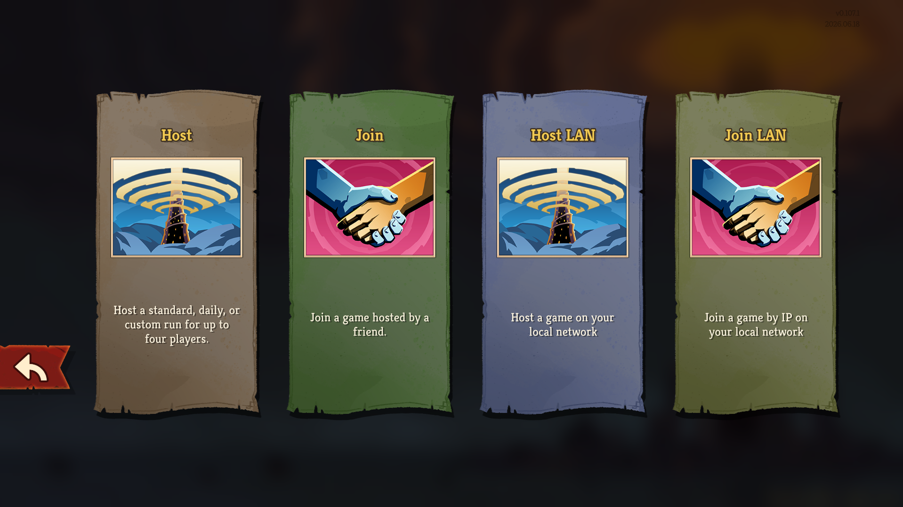
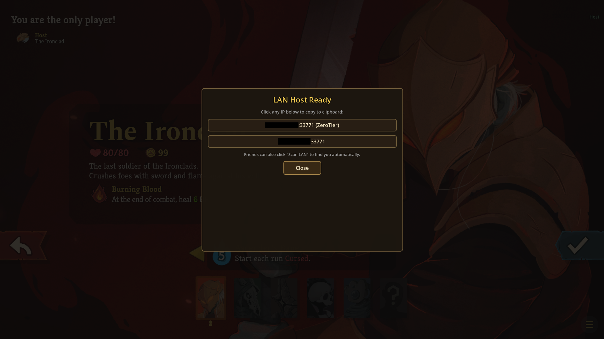
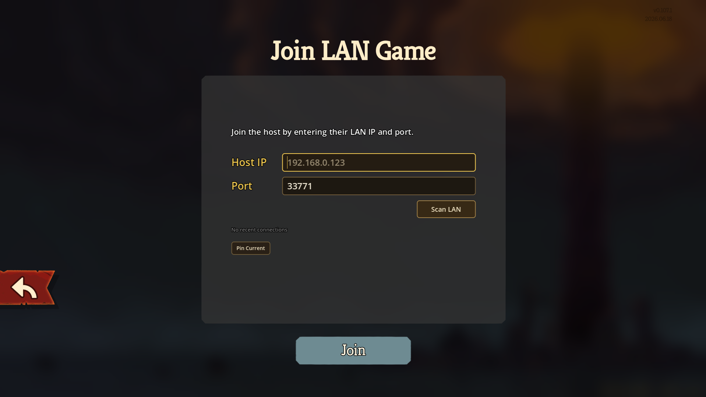

<p align="center">
  
</p>

<p align="center">
  <strong>Local LAN Co-op for Slay the Spire 2</strong><br/>
  Play with friends on your home network or VPN. Works alongside Steam multiplayer.
</p>

<p align="center">
  <a href="https://github.com/Madlezz/LanSpire/releases"></a>
  <a href="https://github.com/Madlezz/LanSpire/releases"></a>
  <a href="https://github.com/Madlezz/LanSpire/blob/master/LICENSE"></a>
</p>

<p align="center">
  <a href="#quick-start">Quick Start</a> ·
  <a href="#features">Features</a> ·
  <a href="#screenshots">Screenshots</a> ·
  <a href="#install">Install</a> ·
  <a href="#usage">Usage</a> ·
  <a href="#faq">FAQ</a> ·
  <a href="#build">Build</a>
</p>

---

## Quick Start

1. Download the [latest release](https://github.com/Madlezz/LanSpire/releases)
2. Drop the `LanSpire` folder into your game's `mods/` directory
3. Launch the game → Multiplayer → **Host LAN** or **Join LAN**

That's it. The mod auto-configures on first launch.

## Features

### Core Multiplayer

| Feature | Description |
|---------|-------------|
| **Host & Join LAN** | Direct LAN connection via IP or auto-discovery scan |
| **Auto-Discovery** | Click "Scan LAN" to find games on your network |
| **Quick Rejoin** | Pin favorite host IP for one-click reconnect (separate from 5-entry history) |
| **Latency Display** | Ping indicator in top-right corner, updates every 2 seconds |

### Network & Compatibility

| Feature | Description |
|---------|-------------|
| **VPN Support** | Works with common VPNs (ZeroTier, Tailscale, WireGuard, etc.). VPN adapters detected and prioritized |
| **Steam Compatible** | Steam multiplayer still works. LAN buttons added alongside, not replacing |
| **Update Check** | Checks GitHub for new releases on startup, shows toast if update available |

### Advanced

| Feature | Description |
|---------|-------------|
| **Version Tagging** | LAN discovery includes mod version. Warns if host runs different version |
| **Optional Passphrase** | Set `lan_host_passphrase` in config to require password for joining |
| **Connection Resilience** | Auto-retry on transient disconnects, sync stall recovery, 8s grace period for disconnected players |

## Screenshots

<p align="center">
  
  
  
</p>

## Compatibility

| Status | Details |
|--------|---------|
| ⚠️ **Game Version** | Built against STS2 v0.107.1 (gameplay testing ongoing) |
| ✅ **Mod Loader** | Requires game's built-in mod loader (`mods/` folder) |
| ⚠️ **Game Updates** | Can break the mod. Check for updates after game patches |

## Install

1. Download the latest release zip from [Releases](https://github.com/Madlezz/LanSpire/releases)
2. Open your Slay the Spire 2 game folder
3. Open the `mods` folder (create it if it doesn't exist)
4. Copy the `LanSpire` folder from the zip into `mods/`
5. Launch the game

**Expected structure:**
```
Slay the Spire 2/
  mods/
    LanSpire/
      LanSpire.dll
      LanSpire.json
```

## Usage

### Host LAN

1. Main menu → Multiplayer → **Host LAN**
2. Select game mode (Standard, Daily, Custom)
3. Popup shows your IP(s) with VPN labels -- click any IP to copy to clipboard
4. A small "..." button appears in the top-right corner -- click anytime to reopen IP popup
5. Share the IP with your friend, or tell them to **Scan LAN**

### Join LAN

1. Main menu → Multiplayer → **Join LAN**
2. **Pinned Host** -- pin frequently-used IP (e.g. your VPN group's fixed IP) for one-click reconnect
3. **Recent Connections** -- up to 5 saved hosts as quick-access buttons
4. **Scan LAN** -- finds games on your network with live player count `[2/4]`
   - Full rooms greyed out with **[Full]** badge
5. **Manual** -- type host IP (supports `IP:port` format)
6. Auto-retries on flaky connections, 15s timeout for unreachable hosts

### VPN (ZeroTier / Tailscale / WireGuard)

- Works over common VPNs -- use VPN IP instead of LAN IP
- VPN adapters detected by name and prioritized in host popup
- Auto-retry helps with VPN route establishment (routes can take a few seconds)

### In-Game Settings

Settings → General → LAN Multiplayer:

- **Max LAN Players** -- 2-8 players
- **Player Name** -- custom display name (optional)
- **Open Game Log** -- opens `godot.log` in Notepad for debugging

## Firewall

If friends can't connect, ensure these ports are open:

| Port | Protocol | Purpose |
|------|----------|---------|
| `33771` | UDP | Game traffic (required) |
| `33772-33775` | UDP | LAN discovery (optional, for Scan feature) |

## Config

Settings saved automatically on first launch at `%APPDATA%/SlayTheSpire2/LanSpire/lan_config.json`. Most users won't need to touch this.

<details>
<summary><strong>View default config</strong></summary>

```json
{
  "lan_multiplayer_enabled": true,
  "lan_use_custom_player_id": false,
  "lan_custom_player_id": "",
  "lan_player_id": "",
  "lan_multiplayer_save_player_id": "",
  "lan_join_host": "",
  "lan_join_port": 33771,
  "lan_join_history": [],
  "lan_pinned_host": "",
  "lan_host_passphrase": "",
  "lan_debug_logging": false,
  "max_multiplayer_players": 4,
  "max_multiplayer_enabled": true,
  "lan_compatibility_mod_names": [],
  "resilience_sync_stall_recovery": true,
  "resilience_timing_failsafes": true,
  "resilience_disconnect_prevention": true
}
```

</details>

<details>
<summary><strong>Config field reference</strong></summary>

| Field | Default | Description |
|-------|---------|-------------|
| `lan_multiplayer_enabled` | `true` | Master switch. If `false`, no patches applied. |
| `lan_use_custom_player_id` | `false` | Use custom player name instead of auto-generated. |
| `lan_custom_player_id` | `""` | Custom player name (hashed to ulong peer ID). |
| `lan_player_id` | auto | Persistent random peer ID. Auto-generated on first use. |
| `lan_multiplayer_save_player_id` | auto | Last used multiplayer save player ID. |
| `lan_join_host` | auto | Last joined host IP. |
| `lan_join_port` | `33771` | Last joined port. |
| `lan_join_history` | `[]` | Recent connections (up to 5). |
| `lan_pinned_host` | `""` | Pinned/favorite host (IP:port). Shown as separate quick-connect button. |
| `lan_host_passphrase` | `""` | Optional passphrase. If set, joining clients must send same passphrase. Host gets toast on mismatch. |
| `lan_debug_logging` | `false` | Enable verbose diagnostic logs in `godot.log`. Useful for troubleshooting. |
| `max_multiplayer_players` | `4` | Max players in lobby (2-8). |
| `max_multiplayer_enabled` | `true` | Show max players setting in-game. |
| `lan_compatibility_mod_names` | `[]` | Extra mod names for multiplayer compatibility list. |
| `resilience_sync_stall_recovery` | `true` | 30s timeout on sync waits. Prevents freeze on lost UDP packets. |
| `resilience_timing_failsafes` | `true` | Guard against null-ref on early data arrival. |
| `resilience_disconnect_prevention` | `true` | Auto-mark disconnected players as ready after 8s grace. |

</details>

## How It Works

LanSpire adds direct LAN connection alongside the game's existing Steam networking, so you can play with friends on the same network without needing Steam's multiplayer system.

**Steam still works normally** -- the LAN buttons are added on top, and only activate when you specifically choose Host LAN or Join LAN. Switching between Steam and LAN multiplayer is seamless.

## Build

**Prerequisites**: .NET SDK 9.0+, STS2 game files

```bash
# Set game directory (where data_sts2_windows_x86_64/ lives)
export STS2_GAME_DIR="/path/to/Slay the Spire 2"

# Build
cd LanSpire
dotnet build -c Release
```

Output: `bin/Release/net9.0/LanSpire.dll`

> `STS2_GAME_DIR` is **required** -- the build references game assemblies from the game directory.

## Game Logs

If something goes wrong, check the log at `%APPDATA%/SlayTheSpire2/logs/godot.log`. Messages from this mod are tagged with `[LanSpire]`.

## FAQ

<details>
<summary><strong>Does this replace Steam multiplayer?</strong></summary>

No. LanSpire adds LAN buttons alongside the existing Steam multiplayer buttons. Both work independently -- you can use either depending on your network setup.
</details>

<details>
<summary><strong>Does it work over VPN?</strong></summary>

Yes. Use common VPNs (ZeroTier, Tailscale, WireGuard, etc.) and enter the VPN IP instead of your LAN IP. VPN adapters are detected automatically and prioritized.
</details>

<details>
<summary><strong>Scan LAN doesn't detect my friend's room. Why?</strong></summary>

**Scan LAN only works between two PCs running LanSpire.** It will NOT detect:

- **Native Steam multiplayer** rooms -- these use a different system entirely
- **Any other non-LanSpire PC mod** -- discovery requires both sides to speak the same protocol

**What to do instead:**

| You want to join | Use |
|---|---|
| Friend on PC with LanSpire | **Scan LAN** |
| Friend on VPN (ZeroTier, Tailscale, etc.) | **Manual IP** -- enter the VPN IP |
| Friend on Steam multiplayer | Not supported by this mod |

If Scan LAN returns empty even when your PC friend is hosting:
1. Make sure both PCs are on the **same network** (same Wi-Fi / subnet)
2. Make sure **port 33772 UDP** is not blocked by firewall on the host
3. Try **Manual IP** -- ask them for their local IP (shown in Host popup)
</details>

<details>
<summary><strong>My friend can't connect. What do I check?</strong></summary>

1. Make sure port **33771 UDP** is allowed through your firewall
2. If using VPN, make sure both peers can ping each other's VPN IP
3. Try entering IP manually instead of using Scan
4. Check `godot.log` for `[LanSpire]` messages
</details>

<details>
<summary><strong>Will this break when the game updates?</strong></summary>

Possibly. The mod patches specific game methods that may change between updates. Always check for an updated build after the game patches. Built against v0.107.1.
</details>

## Uninstall

1. Close the game
2. Delete the `LanSpire` folder from your game's `mods/` directory
3. (Optional) Delete config: `%APPDATA%/SlayTheSpire2/LanSpire/`

That's it. No registry entries, no background services.

## Known Issues

- **Game updates can break this mod.** LanSpire patches specific game methods that may change between STS2 updates. If the mod stops working after a game patch, check [Releases](https://github.com/Madlezz/LanSpire/releases) for an updated build.
- **LAN Scan is PC-to-PC only.** It will not detect native Steam multiplayer rooms. Use Manual IP for VPN play.
- **VPN route delays.** When using VPNs like ZeroTier or Tailscale, the first connection attempt may fail while routes are being established. The mod auto-retries, but if it still fails, try connecting again after a few seconds.
- **Reflected field names.** The mod relies on private game internals accessed via reflection. A game update that renames these fields will cause silent failures logged in `godot.log`.

## How It Was Made

LanSpire adapts the LAN multiplayer protocol for PC, using Harmony patches to intercept and redirect the game's networking layer. The core approach:

- **Kept**: Message protocol, host/join logic, LAN join UI, player naming, save ID handling
- **Replaced**: Platform-specific settings with file-based JSON configuration (`lan_config.json`)
- **Added**: LAN auto-discovery, connection history, toast notifications, player count display, connection retry, timeout, VPN detection, Quick Rejoin

## Credits

- **Harmony** - runtime patching library for .NET applications

## Related Projects

LanSpire is compatible with:
- [sts2-android-compat](https://github.com/ModinMobileSTS/sts2-android-compat) - Mobile client compatibility layer
- [STS2MobileLauncher](https://github.com/ModinMobileSTS/STS2MobileLauncher) - Mobile launcher for STS2

## License

MIT -- same as the original project.
